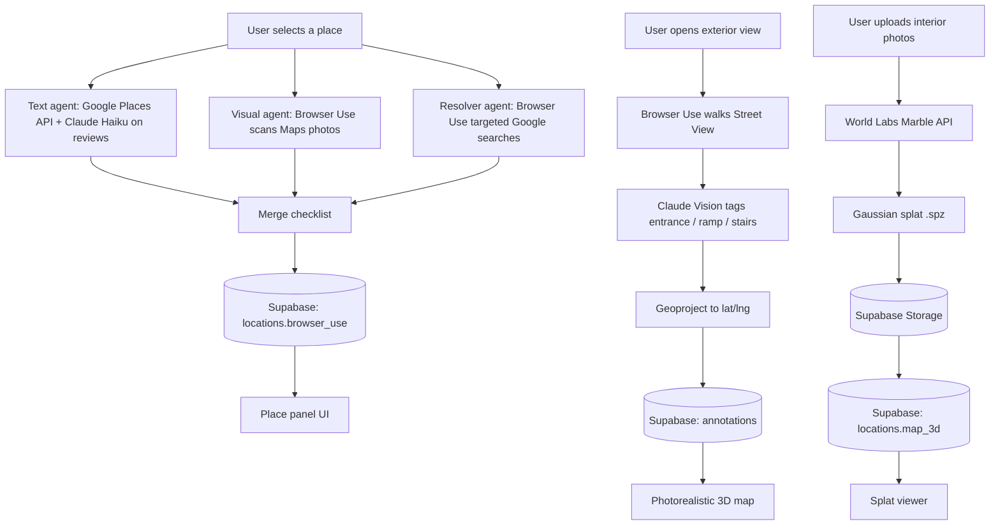

# Straightline

An ADA accessibility auditing tool that scores real-world locations from public web data and lets you preview a building's interior in 3D before you visit.

Devpost: [devpost.com/software/straightline](https://devpost.com/software/straightline)
Live product: [straight-line.tech](https://www.straight-line.tech/)

## Demo

[DEMO GIF OR VIDEO LINK GOES HERE]

## How it works

A user searches for a place on the map. That kicks off three things in parallel:

1. **Text agent**: an instant call to the Google Places API for wheelchair-accessibility attributes and reviews, enriched by a Claude Haiku pass over the review text for accessibility clues.
2. **Visual agent**: a Browser Use session that opens the location's Google Maps photos and scores a 10-item ADA checklist (accessible route, entrance, door width, ramps, parking, elevator, restroom, pathway width, counter height, signage) from what it sees.
3. **Resolver agent**: a second Browser Use session that runs targeted Google searches for any checklist items the first two agents left as "unknown."

The three results are merged (met > not_met > unknown > na) and written to a `locations` row in Supabase, keyed by name, so a repeat visit to the same place is a cache hit instead of a new agent run.

From there:

- **Exterior view**: a "Auto-Annotate" button spins up another Browser Use session that walks Google Street View around the building, taking screenshots at four headings. Each screenshot goes through Claude Vision to detect entrances, ramps, and stairs, which are geoprojected back onto lat/lng and saved as annotations on a photorealistic Google 3D map. Falls back to the Street View Static API if Browser Use can't capture screenshots directly.
- **Interior view**: the user uploads up to 8 photos of the interior, which are sent to World Labs' Marble API to generate a Gaussian splat. The resulting `.spz` file is downloaded, stored in Supabase Storage, and referenced from the location record so it loads instantly next time.



## What I built

I built the agent orchestration layer that produces the ADA accessibility score: the text/visual/resolver agent pipeline, the merge logic that resolves conflicting checklist results, and the Claude Haiku enrichment step that pulls accessibility clues out of raw review text. I also built the Supabase backend, including the `locations` table schema, the caching logic that checks for an existing audit before spending agent budget on a new one, and the upsert paths that persist checklist and annotation data. Error handling favors graceful degradation. If the visual and resolver agents both fail to start, the API still returns whatever the text agent found instead of failing the whole request.

## What my teammates built

My teammates built the rest of the app: the interactive map and place-search UI, the Street View annotation interface, the live agent-activity viewer, and the Gaussian Splatting 3D frontend that renders the interior splat models.

## Built with

- Next.js 16 (App Router) + React 19
- TypeScript
- Tailwind CSS v4
- Browser Use (autonomous browser agents)
- Anthropic Claude API (Haiku for review parsing, Sonnet for Street View vision)
- World Labs Marble API (Gaussian splat generation)
- `@mkkellogg/gaussian-splats-3d` + Three.js (splat rendering)
- Supabase (Postgres + Storage)
- Google Maps Platform (Places, Photos, Street View Static, 3D Maps via `@vis.gl/react-google-maps`)

## Running locally

```bash
npm install
npm run dev
```

Open [http://localhost:3000](http://localhost:3000).

You'll need a `.env.local` with:

| Variable | Description |
|---|---|
| `NEXT_PUBLIC_SUPABASE_URL` | Supabase project URL |
| `NEXT_PUBLIC_SUPABASE_ANON_KEY` | Supabase anon/public API key |
| `MAPS_KEY` | Google Places API key (server-side calls) |
| `NEXT_PUBLIC_MAPS_KEY` | Google Maps Platform key (client-side map, Street View Static fallback) |
| `BROWSER_USE_KEY` | Browser Use API key |
| `CLAUDE_KEY` | Anthropic API key |
| `WORLD_LABS_KEY` | World Labs API key for Gaussian splat generation |

Run `supabase/schema.sql` in the Supabase SQL editor to create the `locations` table before starting the app. You'll also need a Supabase Storage bucket named `models` for splat files and an `annotations` table (referenced by the API but not included in `schema.sql`, so add it manually or via migration).

---

Built in 36 hours at DiamondHacks 2026 (UCSD). 1st place, Best Use of Browser Use.
